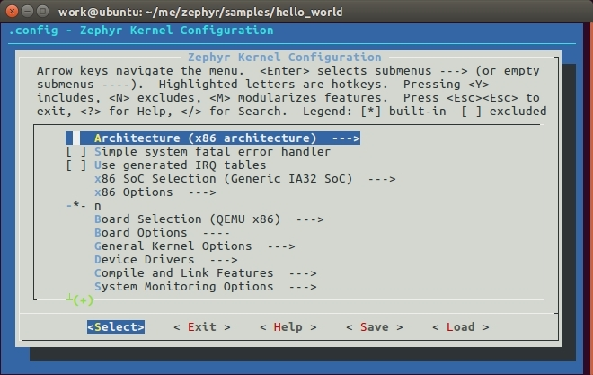
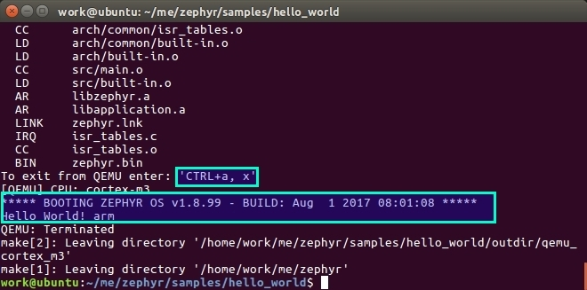

title: 在 Ubuntu 上面搭建 Zephyr OS 开发环境
---

> 作者：[tidyjiang8](http://github.com/tidyjiang8/)

如果对 Linux 有一点基础的话，建议使用 Linux 作为开发环境。我们这里以 Ubuntu 为例。

如果你的操作系统是 win10 的话，可以直接使用 win10 的 Ubuntu 子系统，再也不需要笨重虚拟机了，非常方便，感谢微软的努力。具体过程请参考教程 [使用Win10的Liux子系统搭建Zephyr OS开发环境](win10-wsl.html)。

如果你自己没有 Ubuntu 系统的话，可以直接使用我提供的 Ubuntu 硬盘镜像快速搭建开发环境。在这个硬盘镜像里，我已经安装好了所有环境，你只需要导入一下就可以了。具体过程请参考 [使用预安装Ubuntu硬盘镜像快速搭建Zephyr OS开发环境](pre-install.html)。

# 安装依赖的软件包

```bash
$ sudo apt-get install git make gcc g++ ncurses-dev doxygen dfu-util device-tree-compiler python-pip3
```

# 安装 SDK

Zephyr 的 SDK 中包含编译 Zephyr OS 源码的各种工具链以及一些主机工具。进入官方仓库 [zephyrproject-rtos/meta-zephyr-sdk
](https://github.com/zephyrproject-rtos/meta-zephyr-sdk/releases)，下载后缀为 `.run` 的最新 SDK。当前的最新版为 Zephyr SDK 0.9.1。

可以直接使用命令进行下载：
```bash
$ wget https://github.com/zephyrproject-rtos/meta-zephyr-sdk/releases/download/0.9.1/zephyr-sdk-0.9.1-setup.run
```

下载完成后，先添加可执行权限，然后进行安装：
```bash
$ sudo chmod +x zephyr-sdk-0.9.1-setup.run
$ sudo ./zephyr-sdk-0.9.1-setup.run
```

> 默认会安装在 `/opt/zephyr-sdk-xxx/` 下面，建议直接使用这个默认的安装路径即可。

安装完成后，配置一些与 Zephyr 相关的环境变量：
```bash
$ cat <<EOF > ~/.zephyrrc
export ZEPHYR_GCC_VARIANT=zephyr
export ZEPHYR_SDK_INSTALL_DIR=/opt/zephyr-sdk
EOF
```

# 下载 Zephyr 源代码

## 直接下载

- 最新开发分支的代码：[https://github.com/zephyrproject-rtos/zephyr/archive/master.zip](https://github.com/zephyrproject-rtos/zephyr/archive/master.zip)
- 最新稳定分支 v1.8.0 的代码：[https://github.com/zephyrproject-rtos/zephyr/archive/zephyr-v1.8.0.zip](https://github.com/zephyrproject-rtos/zephyr/archive/zephyr-v1.8.0.zip)

## Git 下载

```bash
$ https://github.com/zephyrproject-rtos/zephyr.git
```

# 编译 hello-world

除了在上面配置的那两个环境变量外，Zephyr 编译应用程序还需要一些额外的变量，这些变量是使用脚本文件 `zephyr-env.sh` 来设置的。先进入 Zephyr 根目录，然后配置环境变量：
```
$ cd zephyr
$ source zephyr-env.sh
```

进入 hello-world 目录，编译：
```
$ cd samples/hello-world
$ make
```

上面的 make 命令会使用应用程序的 Makefile 文件中定义的默认设置编译 hello_wolrd 例程。你可以定义环境变量 `BOARD` 为所支持的其它板子编译应用，例如：`make BOARD=arduino_101`。关于 make 命令的具体使用方法可以执行 make help。

# 对应用程序进行配置

Zephyr 提供了一个图形化配置界面 menuconfig。你可以在编译应用程序前使用该工具选择你所需的功能：
```
$ make BOARD=frdm-k64f menuconfig
```

<center>



</center>

关于 menuconfig 的详细用法，请参考：[https://www.zephyrproject.org/doc/application/application.html#overriding-default-configuration](https://www.zephyrproject.org/doc/application/application.html#overriding-default-configuration)。

# 使用 QEMU 仿真

Zephyr 支持在 x86、ARM Cortex-M3 和 Xtensa 等多种架构下使用 qemu 进行仿真。

对 x86 架构进行仿真：
```bash
$ make BOARD=qemu_x86 run
```

对 ARM Cortex-M3 架构进行仿真：
```bash
$ make BOARD=qemu_cortex_m3 run
```

对 Xtensa 架构进行仿真：
```
$ make BOARD=qemu_xtensa run
```


<center>



仿真结果

</center>

退出仿真界面的方法：**先按 CTRL+a，再按 x**。

